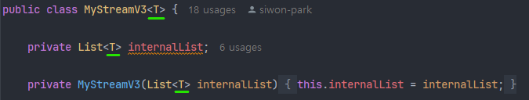
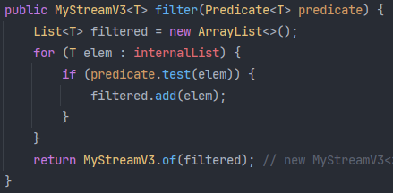
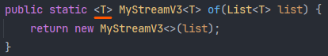
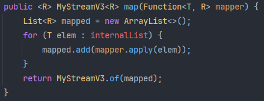

# 23_제네릭(Generic)

> 자바의 제네릭

## 1. 개념

제네릭(Generic)이란 자바 5(java 1.5)부터 도입된 개념으로, 코드 작성 시 타입을 지정하지 않고 실제 사용할 때 타입을 지정하는 자바의 문법을 말한다.

클래스를 정의할 때 타입을 정하지 않고, 객체(인스턴스)를 만들 때 타입을 지정하는 것이다.

### 1) 장점(사용 이유)

> 잘못된 타입 사용으로 인해 발생할 수 있는 타입 에러를 컴파일 시점에서 체크하고, 코드 재사용성과 불필요한 타입 캐스팅을 방지하여 자원 낭비를 막는다.

- 컴파일 시점에 타입을 체크하여 타입 체크를 통해 타입 오류를 잡을 수 있다. (타입 안정성 확보)
  - 잘못된 타입을 사용하는 것을 방지한다. (ClassCastException 방지)
- 불필요한 타입 캐스팅 생략
  - 타입 캐스팅 역시 자원을 소모하기 때문에 좋지 못하다.
- 코드 재사용성의 증가
  - 클래스를 정의할 때 구체적인 타입을 지정하여 정의한다면 각 타입별로 클래스를 만들어야 하는 대참사가 발생하지만, 제네릭을 통해서 하나의 클래스만 정의해도 여러 타입에 대응할 수 있다.

### 2) 특징

- 클래스, 인터페이스, 메서드에 선언할 수 있다.
- 동시에 여러 타입을 선언할 수 있고, 와일드 카드를 사용하여 타입을 유연하게 처리할 수도 있다.
- 참조형(Reference Type)만 타입으로 지정 가능하다.
  - 원시 타입(Primitive Type)은 사용이 불가능하다. 이는 제네릭이 런타임 시 Object로 대체되는데, 원시 타입은 Object의 자식이 아니기 때문에 사용이 불가능한 것이다.
- 컴파일 단계에서 컴파일러에 의해서 타입을 체크한 다음, 실제 런타임 때는 타입 정보가 사라진다.
  - 타입 소거(Type Erasure)라고 하며, 런타임 시점에는 모두 Object 타입으로 다뤄진다.
  - 모든 제네릭 코드는 Object를 기반으로 동작한다.
- 불공변성(Invariant)이다.
  - 상속에 관계 없이 자기 타입만 허용 가능하다. 즉, String이 Object의 자식임에도 불구하고  `List<String>`은 `List<Object>`로 변환이 불가능하다.
  - 와일드카드 `<?>`과는 다른 개념.

<br>

## 2. 제네릭 문법

### 1) 자주 사용하는 인자

- `<T>`: 타입(Type)
  - 보통 첫 번째 타입으로 `<T>`를 쓰지만, 만약에 두 번째, 세 번째 제네릭 타입이 필요할 경우에는 for 문에서 i, j, k 순서로 사용하듯이 `<S>`, `<U>`, `<V>`, `<W>` 등으로 알파벳 순서로 이어 간다.
- `<R>`: 결과(Result)
- `<E>`: 요소(Element)
- `<K>`: 키(Key)
- `<V>`: 값(Value)
- `<N>`: 숫자(Number)

#### (1) 혼용

- `<T, R>`과 같이 꺽쇄 안에 두 개의 타입을 선언한 경우도 있는데, 순서대로 `<입력, 출력>`을 의미한다.
  - 문법은 아니고, 자바의 모든 표준 함수형 인터페이스가 이렇게 입력, 출력 순으로 정의를 해놓았기 때문이다.
  - 만약에 직접 함수형 인터페이스를 정의해서 출력, 입력 순으로 순서를 바꿔도 코드는 동작하지만, 나중에 유지보수할 때 엄청난 혼란을 야기할 수 있는 잘못된 행동이다.

### 1) 클래스 수준의 제네릭

클래스를 정의할 때 사용한 `<T>`와 필드의 `<T>`는 모두 클래스 수준의 제네릭 타입이다.



#### (1) 일반(인스턴스) 메서드 - 1

클래스의 타입인 기존 `<T>`와 같은 타입을 반환하니, 메서드 수준에서 타입 재정의가 필요 없다.



static 메서드와의 차이가 있다면, static 메서드에서는 `<T>`로 맨 앞에 작성된 부분이 있는데 이는 static 메서드가 클래스에서 바로 호출 가능하기 때문에 그렇다.

일반(인스턴스) 메서드의 경우 인스턴스 생성 시 타입이 결정되기 때문에 메서드 호출 시점에 타입을 알 수 있지만, static 메서드의 경우 클래스 차원에서 호출하므로 아직 생성도 하지 않은 클래스의 타입을 알 수 없기 때문에 메서드 수준에서 `<T>` 타입을 새로 정의해주는 과정이 필요하다. => 즉, 이 때 클래스의 타입과 static 메서드의 타입은 서로 다를 수도 있다.

### 2) 메서드 수준의 제네릭

#### (1) static 메서드

메서드 선언부의 맨 앞의 `<T>`는 메서드 수준의 제네릭 타입으로 클래스 수준에서 선언한 타입인 `<T>`와 다르다.

메서드 수준의 `<T>`는 "타입 변수 선언"이며, "지금부터 이 메서드 안에서 T라는 이름을 타입을 대표하는 변수로 사용하겠다"고 선언하는 것이다.

메서드 호출 시 전달받은 인자의 타입에 따라 `<T>`가 결정된다.



```java
public <T> T method1(T params) {...} 
```

- `<T>`: "지금부터 이 메서드 안에서 `<T>`라는 이름표를 타입 변수로 사용할 것이다"를 선언
- `T`: "이 메서드가 끝나면 T라는 타입의 결과물을 전달할 것이다"를 선언
  - 그런데 입력 파라미터의 타입도 T임을 선언

굳이 `<T>`로 써도 무방하지만 헷갈릴 가능성이 있다면, 다음과 같이 다른 알파벳으로 구분해서 사용해도 무방하다. (그러나 권장되는 관례는 아니다.)

```java
public static <U> MyStreamV3<U> of(List<U> list) {
    return new MyStreamV3<>(list);
}
```

#### (2) 일반(인스턴스) 메서드 - 2

메서드 수준에서 타입을 재정의하는 경우가 있는데, 이는 메서드에서 반환하는 타입이 클래스의 타입과 전혀 다른 새로운 타입일 때 사용한다.

다음과 같이 `<T>` 타입으로 제네릭을 선언한 클래스 안에서 

```java
public class MyStreamV3<T> { ... }
```



map 메서드의 반환 타입은 `<R>`이고, 파라미터의 `Function<T, R>`의 `<T>`는 클래스 수준의 제네릭 타입 T이다. 클래스 수준에서 선언한 타입과 전혀 다른 타입을 선언하기 위해서 메서드 앞에 `<R>`을 붙인 것이다.

### 3) 클래스 수준 vs 메서드 수준

클래스 수준의 타입과 메서드 수준의 타입을 밑줄로 구분하면 다음과 같다.

- 클래스 수준: 클래스 타입의 파라미터를 가져와서 사용; 클래스와 타입이 같음.
  - addBox의 T는 클래스의 T를 따라간다.
  - 만약에 메서드만의 별도 제네릭이 필요할 경우에는 메서드의 접근 제어자 뒤에 `<T>`를 작성해줘야 한다.

- 메서드 수준: 메서드의 인자로 전달받은 파라미터에 의해 타입이 결정됨; 클래스와 타입이 다를 수도 있음.
  - addBoxStatic의 경우 굳이 static 메서드가 아니더라도 `<T>`를 앞에 작성했기 때문에 이 때의 T는 클래스의 타입과 다른 타입이 될 수도 있다.
  - 결론적으로 메서드 앞에 `<T>`가 있다면 메서드 수준에서 제네릭을 정의한 것이라고 이해하면 된다.


### 4) 메서드 수준 제네릭 앞에 `<T>`가 필요한 이유

| 클래스 제네릭        | 메서드 선언                | 올바른 선언         |
| -------------------- | -------------------------- | ------------------- |
| 있음(`class Box<T>`) | `public T add() {...}`     | 가능                |
| 없음                 | `public <T> T add() {...}` | 가능                |
| 없음                 | `public T add() {...}`     | 불가능(컴파일 에러) |

클래스 제네릭이 없는 상황에서 메서드 수준의 제네릭 `<T>`가 없을 경우 컴파일 에러가 발생한다.

그 이유는 그냥 T만 달랑 쓸 경우 컴파일러는 해당 T가 타입인지 클래스인지 식별할 수 있는 기준이 없기 때문에, 실제로 존재하는 클래스 이름으로 간주하여 T.class라는 클래스 파일을 찾으려고 한다. 이 때 T라는 이름의 클래스가 없기 때문에 컴파일 에러가 발생하는 것이다.

하지만 `<T>`를 선언하는 순간, 컴파일러는 `<T>`  바로 뒤의 `T`를 클래스가 아닌 "타입 변수의 이름표"라고 간주하여 에러 없이 정상적으로 컴파일할 수 있게 된다.