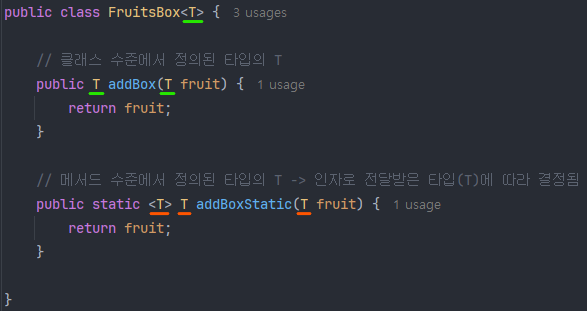

# 23_제네릭(Generic)

> 자바의 제네릭

## 1. 개념

제네릭(Generic)이란 자바 5(java 1.5)부터 도입된 개념으로, 코드 작성 시 타입을 지정하지 않고 실제 사용할 때 타입을 지정하는 자바의 문법을 말한다.

클래스를 정의할 때 타입을 정하지 않고, 객체(인스턴스)를 만들 때 타입을 지정하는 것이다.

### 1) 장점(사용 이유)

> 잘못된 타입 사용으로 인해 발생할 수 있는 타입 에러를 컴파일 시점에서 체크하고, 코드 재사용성과 불필요한 타입 캐스팅을 방지하여 자원 낭비를 막는다.

- 컴파일 시점에 타입을 체크하여 타입 체크를 통해 타입 오류를 잡을 수 있다. (타입 안정성 확보)
  - 잘못된 타입을 사용하는 것을 방지한다. (ClassCastException 방지)
- 불필요한 타입 캐스팅 생략
  - 타입 캐스팅 역시 자원을 소모하기 때문에 좋지 못하다.
- 코드 재사용성의 증가
  - 클래스를 정의할 때 구체적인 타입을 지정하여 정의한다면 각 타입별로 클래스를 만들어야 하는 대참사가 발생하지만, 제네릭을 통해서 하나의 클래스만 정의해도 여러 타입에 대응할 수 있다.

### 2) 특징

- 클래스, 인터페이스, 메서드에 선언할 수 있다.
- 동시에 여러 타입을 선언할 수 있고, 와일드 카드를 사용하여 타입을 유연하게 처리할 수도 있다.
- 참조형(Reference Type)만 타입으로 지정 가능하다.
  - 원시 타입(Primitive Type)은 사용이 불가능하다. 이는 제네릭이 런타임 시 Object로 대체되는데, 원시 타입은 Object의 자식이 아니기 때문에 사용이 불가능한 것이다.
- 컴파일 단계에서 컴파일러에 의해서 타입을 체크한 다음, 실제 런타임 때는 타입 정보가 사라진다.
  - 타입 소거(Type Erasure)라고 하며, 런타임 시점에는 모두 Object 타입으로 다뤄진다.
  - 모든 제네릭 코드는 Object를 기반으로 동작한다.
- 불공변성(Invariant)이다.
  - 상속에 관계 없이 자기 타입만 허용 가능하다. 즉, String이 Object의 자식임에도 불구하고  `List<String>`은 `List<Object>`로 변환이 불가능하다.
  - 와일드카드 `<?>`과는 다른 개념.

<br>

## 2. 제네릭 문법

### 1) 자주 사용하는 인자

- `<T>`: 타입(Type)
  - 보통 첫 번째 타입으로 `<T>`를 쓰지만, 만약에 두 번째, 세 번째 제네릭 타입이 필요할 경우에는 for 문에서 i, j, k 순서로 사용하듯이 `<S>`, `<U>`, `<V>`, `<W>` 등으로 알파벳 순서로 이어 간다.
- `<R>`: 결과(Result)
- `<E>`: 요소(Element)
- `<K>`: 키(Key)
- `<V>`: 값(Value)
- `<N>`: 숫자(Number)

### 2) 사용 예시 설명

#### (1) 클래스 수준

클래스를 정의할 때 사용한 `<T>`와 필드의 `<T>`는 모두 클래스 수준의 제네릭 타입이다.


#### (2) 메서드 수준

##### static 메서드

메서드 선언부의 맨 앞의 `<T>`는 메서드 수준의 제네릭 타입으로 클래스 수준에서 선언한 타입인 `<T>`와 다르다.

메서드 호출 시 전달받은 인자의 `<T>`에 따라 타입이 결정된다.


따라서 굳이 `<T>`로 써도 무방하지만 헷갈릴 가능성이 있다면, 다음과 같이 다른 알파벳으로 구분해서 사용해도 무방하다.

```java
public static <U> MyStreamV3<U> of(List<U> list) {
    return new MyStreamV3<>(list);
}
```

##### 일반 메서드 - 1

기존의 타입인 `<T>`와 같은 타입을 반환하니, 메서드 수준에서 타입 재정의가 필요 없다.


static 메서드와의 차이가 있다면 static 메서드에서는 `<T>`로 맨 앞에 작성된 부분이 있는데, 이는 static 메서드가 클래스에서 바로 호출 가능하기 때문에 그렇다. 객체(인스턴스) 메서드의 경우 인스턴스 생성 시 타입이 결정되기 때문에 메서드 호출 시점에 타입을 알 수 있지만, static 메서드의 경우 클래스에서 호출하므로 아직 생성도 하지 않은 클래스의 타입을 알 수 없기 때문에 메서드 수준에서 `<T>` 타입을 새로 정의해주는 과정이 필요하다.

##### 일반 메서드 - 2

static 메서드가 아님에도 불구하고 메서드 수준에서 타입을 재정의하는 경우가 있는데, 이는 메서드에서 반환하는 타입이 클래스의 타입과 전혀 다른 새로운 타입이기 때문이다.


#### (3) 클래스 수준 vs 메서드 수준

클래스 수준의 타입과 메서드 수준의 타입을 밑줄로 구분하면 다음과 같다.

- 클래스 수준: 클래스 타입의 파라미터를 가져와서 사용; 클래스와 타입이 같음.
- 메서드 수준: 메서드의 인자로 전달받은 파라미터에 의해 타입이 결정됨; 클래스와 타입이 다를 수도 있음.

