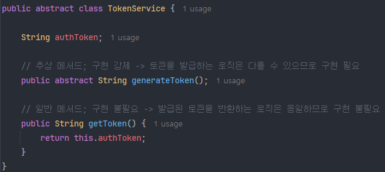

# 24_추상 클래스와 인터페이스

> 추상클래스와 인터페이스의 개념과 차이점

 

## 1. 추상 클래스(Abstract Class)

`abstract` 키워드가 붙은 클래스로 추상 메서드(abstract method)와 일반 메서드로 이루어진 클래스이다.

추상 클래스와 메서드는 그 자체로서 특정한 기능을 하기는 어렵고 상속(extends)을 통해서 사용해야 한다.

여러 클래스들에서 동일하게 사용하는 공통 필드 / 메서드가 있을 때 이를 추상 클래스의 일반 메서드로 분리하여 코드의 중복을 피하고, 각 클래스들만의 고유하면서도 일부 구현이 필요한 기능들은 추상 메서드를 두어 상속을 통해 구현을 강제하고자 할 때 사용한다.

- 추상 메서드 역시 abstract라는 키워드가 붙은 메서드로 메서드 시그니처만 있고 내용은 없는 빈 메서드로 구현이 강제된다.
- 반면 일반 메서드의 경우 추상 클래스에서 정의, 구현하여 상속을 통해 그대로 사용한다. 일반적으로 상속된 클래스들에서 사용하는 공통된 기능들을 일반 메서드로 구현한다.

### 1) 추상 클래스를 사용하는 이유?

추상 클래스의 추상 메서드는 인터페이스의 일반(추상) 메서드에, 일반 메서드는 인터페이스의 default/static 메서드에 대응된다고 볼 수 있다. 거의 대응되는 기능을 제공하기 때문에 굳이 추상 클래스를 써야하나 싶기도 하지만, 인터페이스와의 명백한 차이점이 존재한다.

- 상태(필드) 관리가 필요할 때
  - 인터페이스는 변수를 가질 수 없다. (상수만 가질 수 있음)
  - 하위 클래스에서 사용할 공통된 변수를 정의하여 상태를 관리할 필요성이 있을 때
- 생성자, 초기화 로직이 필요할 때
  - 인터페이스는 생성자를 가질 수 없다.
  - 상속을 통해 부모의 상태가 필요할 때, 자식 클래스에서 super()를 통해 부모의 상태를 가져와서 초기화할 수 있다.
    - 단, 추상 클래스는 생성자를 가질 수 있지만 인스턴스 생성은 불가한 점 유의 => 자식의 생성자에서 활용하기 위함이라고 보면 됨.
- 비즈니스 로직 재사용, 확장과 접근 제어자의 다양성
  - 인터페이스는 public만 가능하지만, 추상 클래스는 private, protected 메서드도 정의할 수 있다.
  - 인터페이스의 default/static 메서드는 모든 구현체가 같은 로직을 구현하지만 상태를 저장하거나 생성자 기반의 로직을 활용할 수 없다는 단점이 있다.
  - 반면 추상 클래스는 공통된 로직은 일반 메서드로 미리 구현을 해두고, 하위 클래스에서 추상 메서드를 구현함으로써 비즈니스 로직을 재사용하고 확장해서 활용할 수 있다.

 

## 2. 인터페이스(Interface)

여러 클래스들의 공통된 동작, 기능을 정의해놓은 명세서.

공통된 동작, 기능만 정의하고 구현체에서 구현을 자유롭게 맡기고 싶을 때, 다중 구현이 필요할 때 사용한다.

java 8부터는 인터페이스에서도 모든 구현체가 공통된 기능을 가질 수 있도록 default/static 메서드를 정의 및 구현할 수 있기 때문에 추상 클래스와 유사한 점이 생겼다.

다만, 가장 큰 차이점으로는 인터페이스는 상수만 선언하여 상태 관리가 불가능한데 추상 클래스는 변수를 정의할 수 있어 상태 관리가 가능하다는 점과 인터페이스는 여러 인터페이스를 다중 구현할 수 있지만 추상 클래스는 단일 상속밖에 되지 않는다는 큰 차이점이 존재한다.

### 1) 선택 기준

인터페이스를 사용할지, 추상 클래스를 사용해야 할지 선택 기준이 필요하다면 다음과 같다.

- "공통된 동작, 기능의 명세"만 필요 => 인터페이스 (다중 구현, default 메서드 활용)
- "공통된 동작, 기능 + 공통된 상태, 코드, 생성자" 필요 => 추상 클래스(추상 메서드 구현, 일반 메서드, 필드/생성자 활용)

 

## 3. 요약

| 항목      | 추상 클래스         | 인터페이스                          |
| --------- | ------------------- | ----------------------------------- |
| 목적      | 공통 기능 + 구현    | 구현(기능 명세, 설계)               |
| 메서드    | 추상 + 일반 메서드  | default/static 메서드 + 일반 메서드 |
| 필드      | 인스턴스 변수, 상수 | 상수(publci static final)           |
| 생성자    | O                   | X                                   |
| 객체생성  | X                   | X                                   |
| 상속/구현 | 단일 상속, extends  | 다중 상속(다중 구현), implements    |
| 구현 강제 | 추상 메서드만 강제  | 모든 일반 메서드 구현 강제          |

### 1) 인터페이스 vs. 추상 클래스

#### (1) 인터페이스

"기능 명세"에 집중.

- "이 구현체가 이러한 기능을 구현하기로 약속(계약)했다. 그래서 이러한 기능들을 반드시 갖고있다."
- 실제 구현체에서 구현을 어떻게 했는지는 신경 쓰지 않음.
- 스프링 DI에서는 인터페이스 기반의 설계가 압도적으로 많음.
  - 물론 인터페이스를 사용해서 단일 구현을 많이 하지만, 향후 정말로 다중 구현이 필요해질 수도 있고(확장성), 인터페이스의 경우 모든 메서드가 강제 구현이기 때문에 구현체 교체(느슨한 결함도), 테스트 등에 있어 보다 용이하다는 장점이 있다.

#### (2) 추상 클래스

"공통 구현 코드와 상태"에 집중.

- "이 클래스는 일부 공통된 동작은 이미 만들어져 있어, 그러나 나머지는 반드시 구현해."
- 상속 구조에서 공통된 메서드, 로직, 필드(상태)의 공유가 필요할 때.

인터페이스는 설계적인 측면에 더 초점이 맞춰져 있다면, 추상 클래스는 로직적인 측면에 더 초점을 두고 있다고 볼 수 있다.