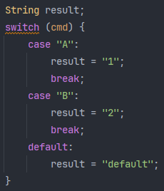
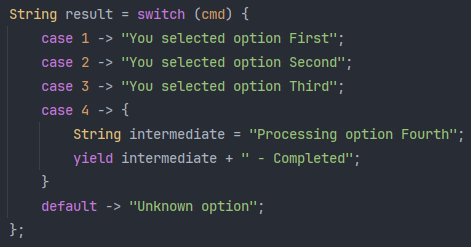

# 27_switch expression

> java 12+ 부터 도입된 새로운 switch 표현식

## 1. 기존의 switch 구문

기존의 switch 구문은 결과값을 반환하지 않는 문장(statement)이다.



### 1) 단점

기존의 switch 구문에서의 case는 fall through가 있어 이를 방지하기 위해서 매 case마다 break 작성이 필수적이다. 이 때문에 코드가 장황해지고, 실수로 break문을 누락했을 경우 코드가 잘못 동작하는 대참사가 발생하기도 한다. 경우에 따라 사이드 이펙트가 매우 클 수도 있다.

<br>

## 2. java 12+의 switch 구문

java 12 버전에서 테스트 도입, 14버전부터 정식 도입되었다.



### 1) 특징

#### (1) 화살표(->) 사용

case 구문에서 `:`(콜론) 없이 람다식과 유사하게 화살표(->)를 사용하여 간결하게 표현할 수 있다.

화살표로 작성한 표현식에서는 break를 작성할 필요가 없다. break 누락으로 인한 fall through 방지가 가능하다는 장점이 있다.

#### (2) 값 리턴 가능 (yield)

switch 구문이 값 리턴이 가능해져서 변수에 값을 바로 할당할 수 있다. 따라서 void만 있는 표현식에서 타입(void 포함)이 있는 표현식이 되었다.

yield를 사용하여 람다의 return처럼, 전체 return이 아닌 해당 람다 표현식 내에서만 값을 return하는 것처럼 switch 표현식 내에서 값을 반환할 수 있다.

#### (3) 복수의 case 묶음 가능

기존의 switch-case 구문에서는 하나의 case는 하나의 조건 경우만 처리할 수 있었고, 복수의 case를 처리하기 위해서는 break 없이 fall through 특성을 사용하여 여러 조건에 대한 경우를 처리했다.

```java
case 1:
case 2:
case 3:
	System.out.println("Under Three");
    break;
case 4:
// ... 중략 ...
```

그러나 변경된 switch 표현식에서는 다음과 같이 복수의 case 묶음이 가능하다.

```java
String label = switch (day) {
  case MONDAY, FRIDAY, SUNDAY -> "Weekend";
  case TUESDAY                -> "Tuesday";
  default                     -> "Weekday";
};
```