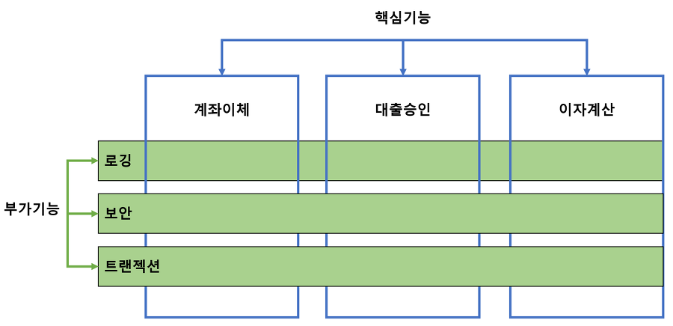
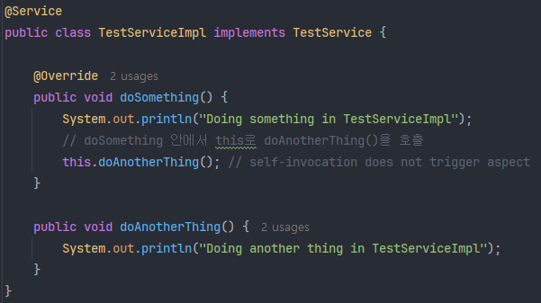
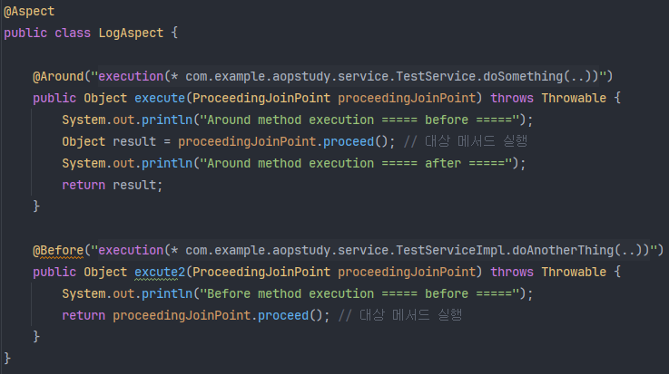
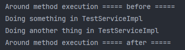

# 07_AOP

> Aspect Oriented Programming; 관점 지향 프로그래밍 

## 1. AOP란?

### 1) 어플리케이션의 기능



소프트웨어를 개발할 때, 구현하는 기능에는 다음과 같이 크게 두 가지로 나눌 수 있다.

- `코어 기능(core concerns)`: 업무 로직, 비즈니스 로직을 포함하는 핵심적인 기능. 종단 관심사라고 함.
- `부가 기능(cross-cutting concerns)`: 핵심 기능을 도와주는 부가적인 기능으로 로깅, 보안, 트랜잭션과 같은 공통적인 기능. 횡단 관심사라고 함.

처음에는 핵심 기능 안에 부가 기능까지 구현을 했다. 그러나 핵심 기능 안에 부가 기능을 같이 개발하다보니 동일한 역할을 하는 부가 기능 코드를 중복으로 작성해야 하는 비효율성과 코드가 난잡해지는 문제가 발생하게 되었다.

이러한 문제를 개선하기 위해 등장한 개념이 `Aspect(관점)`이다.

### 2) AOP (관점 지향 프로그래밍)

관점 지향 프로그래밍(AOP)은 핵심적인 관점 또는 부가적인 관점과 같이 **로직을 기준으로 특정 관점으로 나누어서 이를 기준으로 모듈화하는 프로그래밍 기법**이다.


기존에 클래스 A, B, C에서 핵심 기능이 아닌 부가적인 공통 기능들을 Aspect X, Y, Z로 모듈화하여 핵심 기능과 분리하는 프로그래밍 방식이다.

AOP는 OOP의 대체 개념이 아니라 부족한 부분을 보완하기 위한 개념이다.

<br>

## 2. Spring AOP

> 스프링 AOP는 프록시 기반의 AOP 구현체이며, 스프링 빈에만 AOP를 적용할 수 있다.

스프링 AOP에서 Aspect 모듈은 프록시 기반으로 동작하며, Advice 대상인 Target 역시 프록시 객체이다.

### 1) 프록시(Proxy) 패턴

> 프록시 패턴이란 프록시 객체가 원래 객체를 감싸서 클라이언트의 요청을 처리하는 패턴이다.

인터페이스가 존재하고 클라이언트는 이 인터페이스 타입으로 프록시 객체를 사용한다

프록시 객체는 원래의 객체(Real Subject)를 참조하고 있다.  Proxy 객체와 Real Subject의 타입은 같고, Proxy는 원래 해야 할 일을 가지고 있는 Real Subject를 감싸서 Client의 요청을 처리한다.


#### (1) 프록시 패턴을 사용하는 이유?

> 기존 코드의 변경 없이 접근 제어 또는 부가 기능 추가를 위해서 사용한다

예시)

- EventService interface

```java
public interface EventService {
    void createEvent();
    void publishEvent();
}
```

- TestEventService

```java
@Service
public class EventServiceImpl implements EventService {
    @Override
    public void createEvent() {
        System.out.println("Create Event");
    }
    
    @Override
    public void publishEvent() {
        System.out.println("Publish Event");
    }
}
```

=> 이 코드를 실행시키는 `main`이 client라고 볼 수 있고, EventServiceImpl가 `원래 객체`로 볼 수 있다. 

그런데 EventServiceImpl의 createEvent 메서드와 publishEvent 메서드에 동일한 기능을 하는 코드를 넣고자 할 때, 각각의 메서드에 똑같이 넣어주는 것은 효율성이 떨어진다.

이 때, 프록시 패턴을 사용하여 기존 코드는 건드리지 않고 프록시 객체를 통해서 원하는 기능을 추가할 수 있다.

- ProxyEventServiceImpl

```java
// 원래 객체와 같은 클래스 구현
@Primary
@Service
public class ProxyEventServiceImpl implements EventService { 
    @Autowired
    EventService eventService;
    
    @Override
    public void createEvent() {
        long begin = System.currentTimeMillis(); // 새로 추가한 기능
        eventService.createEvent(); // 원래 객체의 기능
        System.out.println(System.currentTimeMillis() - begin); // 새로 추가한 기능
    }
    
    @Override
    public void publishEvent() {
        long begin = System.currentTimeMillis(); // 새로 추가한 기능
        eventService.publishEvent(); // 원래 객체의 기능
        System.out.println(System.currentTimeMillis() - begin); // 새로 추가한 기능
    }
}
```

- `@Primary` : 같은 타입의 빈이 여러 가지일 때, 그 중 하나를 선택하여 사용하는 어노테이션

이렇게 함으로써 기존 코드 수정 없이 동일한 명칭의 메서드를 호출하되, 추가된 기능을 적용할 수 있게 된다. 

원래 코드에 손을 쓰지 않고도 기능을 추가 할 수는 있지만, 프록시를 구현한 코드를 보면 중복 코드가 발생할 수 있음을 알 수 있고, 다른 클래스에서도 동일한 기능을 사용하고자 할 때, 매번 이를 코딩을 해줘야 하는 부분이 있어 비효율적이다.

#### (2) 자기 호출 제한(self-invocation)

스프링 AOP는 프록시 기반으로 동작하며, 대상 Target 객체 역시 프록시 객체로 동작한다. 이 때, 중요한 점은 프록시 객체이기 때문에 self-invocation에 제한이 있다.

다음과 같이 doSomething() 메서드 안에서 `this` 키워드로 doAnotherThing() 메서드를 호출하고 있다고 하자.



Aspect를 다음과 같이 두 메서드에 대해서 Advice를 적용하는 코드로 작성했다고 할 때, 결과는 어떻게 나올까?



결과는 doSomething() 메서드에 @Around로 설정한 Advice는 적용된 것을 알 수 있지만, doAnotherThing() 메서드에 @Before로 설정한 Advice는 실행되지 않았음을 알 수 있다. 



이는 스프링 AOP가 프록시 기반으로 동작하기 때문에 실제로 doAnotherThing() 메서드를 호출한 것은 실제 객체(Real Object)이기 때문에 Advice가 적용되지 않은 것이다.

doAnotherThing() 메서드에 Advice를 적용하고 싶다면 this로 직접 호출하지 않고 코드 구조를 바꿔서 프록시 객체를 통해서 메서드를 호출하도록 변경해줘야 한다.

### 2) Spring AOP

이러한 횡단 관심사의 중복을 해결해주는 것이 바로 스프링 AOP이다.

스프링 AOP는 `런타임 시, 동적으로 프록시 객체를 만들어준다.`

스프링에서는 aspectj의 문법을 차용하여 aop를 만들었다.

#### (1) 관련 용어

- 어드바이스(Advice): 부가 기능 로직
  - @Around, @Before, @After와 같은 어노테이션을 통해 부가 기능의 실행 시점을 제어할 수 있다.
- 타겟(Target): Advice를 받는 객체 (부가 기능을 받을 대상)
- 조인트 포인트(Joint Point): Advice가 적용될 수 있는 위치. 스프링 AOP는 프록시를 통해서 동작하기 때문에 Advice가 적용될 위치는 타겟의 메서드로 제한된다.
- 포인트 컷(Pointcut): Advice를 적용할 타겟의 위치를 선정하는 표현식. 스프링 AOP에서는 메서드 실행 시점만 포인트 컷을 지정 가능하다.
  - `execution(* 패키지.타겟.메서드(..))`형태의 표현식으로 작성한다.
- 에스펙트(Aspect): 어드바이스 + 포인트 컷을 합친 AOP의 기본 모듈. 스프링에서는 @Aspect 어노테이션을 통해서 클래스 레벨에서 사용 가능하다. (클래스 단위이기 때문에 Aspect 모듈에는 여러 어드바이스 + 포인트컷이 존재할 수 있다.)
  - 스프링 AOP에서는 어드바이저(Advisor)라는 개념이 존재한다. (1Advice + 1Pointcut)

#### (2) 적용 방법

AOP 사용을 위해 의존성을 추가한다

- pom.xml의 경우

```xml
<dependency>
  <groupId>org.springframework.boot</groupId>
  <artifactId>spring-boot-starter-aop</artifactId>
</dependency>
```

- build.gradle의 경우

```
dependencies {
	implementation 'org.springframework.boot:spring-boot-starter-aop' 
}
```


Aspect를 나타내는 클래스 작성 (@Aspect)

```java
@Aspect
@Component
public class PerfAspect {

    @Around("execution(* Room.EventService.*(..))") // point cut
    public Object logPerf(ProceedingJoinPoint joinPoint) throws Throwable {
        // ProceedingJoinPoint가 이 advice가 적용되는 대상임
        long begin = System.currentTimeMillis();
        Object result = joinPoint.proceed();
        System.out.println(System.currentTimeMillis() - begin);
        return result;
    }

}
```

- Aspect의 메서드 자체가 하나의 Advice이다.
- Advice의 실행 시점을 @Around, @Before, @After 어노테이션을 통해 포인트 컷과 함께 작성한다.
- joinPoint.proceed()를 호출하여 포인트 컷에 설정한 타겟의 메서드를 실행시킨다.


※ pointcut을 execution이 아니라 어노테이션을 만들어서 적용할 수도 있다

```java
// 어노테이션 파일 생성
@Documented // javadoc을 만들 때, documentation이 되도록 설정
@Target(ElementType.METHOD) // 메서드만 해당 어노테이션을 붙일 수 있는 타겟이 됨
@Retention(RetentionPolicy.CLASS) // 어노테이션 정보를 얼마나 유지할 것인지 설정(.class 파일까지)
public @interface PerfLogging {
}
```

적용

```java
// 원래 객체에 만든 어노테이션을 적용
@Service
public class EventServiceImpl implements EventService {
    @PerfLogging // 적용
    @Override
    public void createEvent() {
        System.out.println("Create Event");
    }
    
    @PerfLogging // 적용
    @Override
    public void publishEvent() {
        System.out.println("Publish Event");
    }
}
```

Aspect 클래스의 @Around 어노테이션에 execution대신 @annotation을 사용

```java
// @annotation 사용
@Component
@Aspect
public class PerfAspect {

    @Around("@annotation(PerfLogging)") // execution대신 @annotation 사용
    public Object logPerf(ProceedingJoinPoint joinPoint) throws Throwable {
        long begin = System.currentTimeMillis();
        Object result = joinPoint.proceed();
        System.out.println(System.currentTimeMillis() - begin);
        return retVal;
    }

}

// 또는 bean을 사용할 수도 있음
@Component
@Aspect
public class PerfAspect {

    @Around("bean(eventService)") // @annotation대신 bean 사용
    public Object logPerf(ProceedingJoinPoint joinPoint) throws Throwable {
        long begin = System.currentTimeMillis();
        Object result = joinPoint.proceed();
        System.out.println(System.currentTimeMillis() - begin);
        return retVal;
    }

}
```

#### (3) @Component와 @EnableAspectJAutoProxy

※ Aspect 클래스에 @Component를 붙이는 이유?

Aspect 역시 빈으로서 등록되어 싱글톤 객체로 사용된다. 따라서 스프링부트에서는 @SpringBootApplication에 자동 구성 기능이 포함되어 있어서 @Component만 붙여도 빈으로서 등록되어 사용이 가능하다.

다만, Aspect 간의 실행 순서 제어나 특정 설정 등을 적용하기 위해 명시적으로 @Configuration 어노테이션을 통해 직접 코드를 작성하여 @Bean으로 등록하는 경우도 존재한다.

```java
@Configuration
public class AopConfig {

    @Bean
    public LogAspect logAspect() {
        return new LogAspect();
    }
}
```


※ @EnableAspectJAutoProxy

스프링 프레임워크를 사용하고 있다면 반드시 Aspect를 빈으로 등록하는 Config 파일에 해당 어노테이션을 붙여줘야 AOP 프록시 객체를 생성하고 Advice를 적용시킬 수 있다.

하지만 스프링부트는 `spring-boot-autoconfigure` 모듈을 통해서 AOP에 대한 설정을 자동적으로 해주고 있다. 기본값은 `spring.aop.auto=true`로 설정되어 있으며, 이를 application.properties나 application.yml에서 false값으로 변경하면 aspect 및 advice가 적용되지 않는 것을 확인할 수 있다.

- `AopAutoConfiguration` 클래스 내용 및 @ConditionalOnProperty 설정을 보면 자동으로 설정해주고 있음을 확인할 수 있다.
