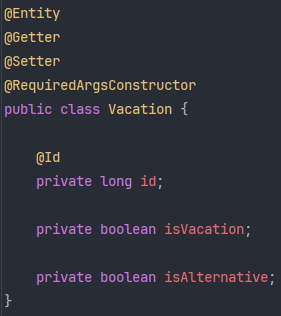

# 27_Gradle Dependency

> Gradle 빌드 시스템의 의존성 타입

## 1. 의존성 타입 종류

### 1) implementation

- 컴파일 타임 + 런타임에서 모두 사용
- 일반적으로 가장 많이 사용되는 의존성 타입

### 2) compileOnly

- 컴파일 시점에만 사용 (런타임에서는 제공되지 않음)
- 컴파일하는 시점에만 참조하여 사용하고 빌드된 결과물(jar, war 등)에는 포함되지 않음

### 3) annotationProcessor

- 컴파일 시점에만 사용 (런타임에서는 제공되지 않음)
- 컴파일 시점에 어노테이션을 처리하여 (런타임에 사용할) 코드를 생성하거나 변형함 (코드를 생성하거나 변환하는 프로세서를 실행)

#### (1) compileOnly와 annotationProcessor 차이

- 공통점: 컴파일 시점에만 필요하며, 런타임 클래스 경로(classpath)에는 포함되지 않음
- 차이점: compileOnly는 해당 의존성을 순수히 컴파일을 하기 위해 사용하고, annotationProcessor는 어노테이션을 처리하여 코드를 만들기 위해 사용함

#### (2) 롬복 예시

다음과 같은 Vacation 엔티티가 있다고 할 때 (직접 Getter, Setter 메서드를 구현하지 않고 @Getter, @Setter 롬복 어노테이션을 적용함)

- compileOnly만 적용

컴파일 결과 Getter, Setter 메서드가 없음. 이 경우 소스 코드에 적용한 @Getter, @Setter 어노테이션은 의미가 없으며, 주석이랑 다를 바가 없음

- compileOnly + annotationProcessor 적용 (※ Spring Initializr로 lombok 적용 시 두 의존성 타입이 디폴트로 추가되어 있음)

컴파일 결과 @Getter, @Setter 어노테이션을 해석하여 Getter, Setter 메서드를 생성함

- annotationProcessor만 적용

롬복 어노테이션 자체를 인식 못해서 컴파일 실패

#### (3) 결론

특정 어노테이션을 해석하여 이를 소스 코드로 만들어야 하는 경우 compileOnly와 annotationProcessor를 함께 적용해야 함

#### (4) compileOnly와 annotationProcessor 분리 이유?

##### 다른 처리 메커니즘

- compileOnly: 컴파일 시점에 클래스패스에 해당 라이브러리를 추가하여 컴파일러가 코드를 검사하고 타입을 확인하여 컴파일만 하는 용도로 사용함
- annotationProcessor: 컴파일 시점에 컴파일러가 소스 코드를 처리하는 도중 어노테이션 프로세서를 호출하여 코드를 분석하고 코드를 변형하거나 새로운 코드를 생성함

##### 성능 최적화

- 불필요한 과정을 생략 가능: 단순히 컴파일하는데만 필요한 경우, 굳이 매번 어노테이션 프로세서를 호출해서 코드를 추가적으로 분석할 필요가 없는데 두 의존성 타입이 합쳐져 있다면 컴파일 시간만 늘어나기 때문에 비효율적임
- 클래스 패스 크기: compileOnly에 annotationProcessor이 합쳐져 있을 경우, compileOnly만 했는데도 불구하고 클래스패스에 불필요한 라이브러리가 추가되는 셈임
  - 예를 들어 compileOnly에 4개의 라이브러리와 annotationProcessor에 1개의 라이브러리만 있으면 되는데 compileOnly에 annotationProcessor이 합쳐져 있을 경우, annotationProcessor를 위해 라이브러리가 불필요하게 로드, 스캔됨

##### 명시적인 의도 표현

각 라이브러리의 용도를 명시적으로 표기할 수 있음

### 4) testImplementation

- 테스트 컴파일 + 테스트 런타임 시에만 사용됨

### 5) testRuntimeOnly

- 테스트 실행 시에만 필요 (테스트 컴파일에서는 필요 없음)

 

## 2. Classifier

> 동일한 아티팩트(그룹 Id, 아티팩트 Id, 버전)에서 변형된 다른 파일을 구분하는데 사용되는 식별자

단순히 동일한 아티팩트에서 변형된 파일을 구분하는 식별자 외에도 특정 라이브러리, 의존성의 API를 지원하는 용도로 구분한다.

- 기본 아티팩트: ``querydsl-apt-5.1.0.jar`
- 특정 용도의 아티팩트: `querydsl-apt-5.1.0-jakarta.jar`, `querydsl-apt-5.1.0-jpa.jar`
  - jakarta api 지원과 jpa api 지원으로 구분 (※ 최신버전에서는 Java EE가 Jakarta EE로 이전되면서 javax.persistence → jakarta.persistence로 변경됨)

### 1) 결론

단순히 gradle, maven dependency에 특정 라이브러리를 추가했다고 해서 끝나는 것이 아니라, 상황 및 버전에 따라 classifier를 반드시 명시해줘야 하는 경우가 있다. (위에서 언급한 Java EE가 Jakarta EE로 이전된 케이스)

#### (1) classifier 확인 방법

maven repository 혹은 git hub, 공식 문서에서 확인 가능

- 예) maven repository: jar 파일 view all을 통해서 확인 가능