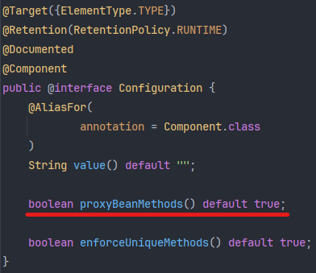
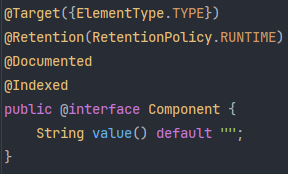

# 28_@Component와 @Configuration

> @Component와 @Configuration의 차이점

## 1. @Component, @Configuration, @Bean

### 1) @Component

> Indicates that the annotated class is a component.
>
> Such classes are considered as candidates for auto-detection when using annotation-based configuration and classpath scanning.

ComponentScan에 의해서 탐지되어 해당 클래스를 스프링 빈으로 사용하겠다는 의미를 가진다.

간단하게 말해서 @Component가 붙은 클래스는 스프링 빈으로서 사용된다는 뜻이다.

### 2) @Configuration

> Indicates that a class declares one or more @Bean methods and may be processed by the Spring container to generate bean definitions and service requests for those beans at runtime, ... 중략 ...

@Configuration이 선언된 클래스는 하나 이상의 @Bean 메서드를 선언하고, @Bean이 붙은 메서드는 빈 메서드로서 스프링 컨테이너에 의해 빈으로 등록된다.

**@Configuration이 붙은 클래스 역시 스프링 빈으로 등록**된다. 왜냐하면 내부적으로 @Component를 가지고 있기 때문이다.

### 3) @Bean

@Bean 어노테이션은 스프링 빈으로 등록할 수 있는 또 다른 수단이지만, @Component, @Configuration 어노테이션들과 다르게 클래스 레벨에서 선언할 수 없다. 메서드 단위에서만 사용할 수 있으며, 그래서 @Bean이 붙은 메서드를 빈 메서드라고 부른다.

<br>

## 2. 차이점

위에 나온 개념들로만 대충 알고 혼용해서 써도 어플리케이션이 돌아가기 한다.

### 1) 흔히 알려진 차이점

흔히 잘 알려진 차이점으로는 @Component는 일반적으로 개발자가 해당 클래스를 스프링 빈으로 등록하기 위해 사용하며 @Configuration은 설정과 관련된 빈 혹은 개발자가 제어하지 못하는 외부의 요소를 빈으로 등록하기 위해 @Bean과 함께 사용한다라고 알려져 있다.

- 왜 개발자가 제어하지 못하는 요소를 빈으로 등록할 때 @Bean을 사용하느냐면 생각보다 간단한데, 외부 패키지나 서드 파티 클래스를 import 해왔을 때 그것을 클래스 레벨에서 빈으로 등록할 방법이 없다. 우리가 작성한 코드가 아니기 때문에 @Configuration이나 @Component를 적용할 방법이 없는 것이다.
- 그래서 보통 @Configuration과 같은 설정 클래스를 만들고 그 안에서 @Bean을 통해 빈 메서드로 생성하여 빈으로 등록해서 사용하는 것이다.

### 2) 정말일까?

그렇다면 @Component에서는 @Bean을 사용할 수 없는걸까? 아니면 사용할 수는 있는데 사용하지 않는 것일까? 정답은 후자에 더 가깝다.

@Component에서도 @Bean으로 빈 메서드를 사용해서 빈을 등록할 수는 있지만 굳이? 혹은 목적에 맞지 않기 때문에 잘 사용하지 않는 것이다.

### 3) 빈을 등록하는 방법의 차이

@Configuration을 확인해보면 @Component와 다르게 proxyBeanMethods의 설정이 true로 되어 있음을 확인할 수 있다.

| @Configuration                                               | @Component                                                   |
| ------------------------------------------------------------ | ------------------------------------------------------------ |
|  |  |

#### (1) proxyBeanMethods

> Specify whether @Bean methods should get proxied in order to enforce bean lifecycle behavior, e.g. to return shared singleton bean instances even in case of direct @Bean method calls in user code. This feature requires method interception, implemented through a runtime-generated CGLIB subclass which comes with limitations such as the configuration class and its methods not being allowed to declare final.

proxyBeanMethods 설정은 true로 되어 있을 경우, @Bean이 선언된 빈 메서드를 호출할 때 해당 빈이 CGLIB 프록시 패턴을 적용해 싱글톤 인스턴스로 생성되게끔 해준다.

즉, @Configuration 내에 있는 @Bean 메서드는 해당 빈이 싱글톤 스코프임을 보장할 수 있는 것이다.

@Configuration 내에 있는 @Bean 메서드를 통해 등록한 빈은 싱글톤으로서 주솟값이 동일하지만, @Component 안에서 @Bean 메서드를 통해 등록한 빈은 객체를 생성할 때마다 새로 등록되기 때문에 매번 주솟값이 다르다.

@Component를 통해서 빈을 등록했을 때 매번 객체를 신규 생성하여 등록하는 것을 Lite Mode라고도 한다.

### 4) 결론

#### (1) 스프링 빈의 싱글톤과 프록시

기본적으로 스프링에서는 빈을 등록할 때 싱글톤 스코프로 등록한다.

하지만 Lite Mode와 같이 실제 인스턴스를 생성하게 되면 실제 객체를 사용한다는 의미이기 때문에 스프링에서 proxy 객체가 필요한 일부 기능들을 사용함에 있어 안정성이 떨어질 가능성이 있다. (proxy 객체를 통해서 싱글톤으로 등록한 실제 객체를 호출하여 동작하는 방식)

대표적인 예로 AOP(관점지향프로그래밍)과 @Transactional을 통한 트랜잭션 관리를 말한다.

(기능이 동작하지 않는다는 의미가 아니라 정상적이고 안정적인 활용을 위해서는 프록시 패턴 + 싱글톤이 합리적이라는 의미이다.)

#### (2) @Configuration + @Bean을 더 자주 사용하는 이유

- 의미상 명확함

  - 해당 클래스는 설정을 담당하는 클래스로, 외부의 패키지나 서드파티 클래스들을 싱글톤 스코프로 빈으로 등록하겠다는 의도가 명확해진다.
  - 또한 관련 빈들을 논리적으로 그룹핑할 수 있고, 의도 또한 보다 명확해진다.

- 등록할 빈 간에 의존성이 있을 때 안전함

  - 여기 저기서 @Bean으로 등록하는 것보다 @Configuration 클래스 안에서 함께 등록하여 의존 관계에 있는 빈의 등록을 관리할 수 있다.

    ```java
    @Configuration
    public class AppConfig {
        @Bean
        public PasswordEncoder passwordEncoder() {
            return new BCryptPasswordEncoder();
        }
        
        @Bean
        public UserService userService() {
            // 같은 PasswordEncoder 인스턴스 보장
            return new UserService(passwordEncoder());
        }
    }
    ```

#### (3) @Component + @Bean은 언제 사용?

사실 사용할 일이 정말 거의 없겠지만, 빈 간의 의존성이 없거나 굳이 팩토리 패턴을 사용하여 빈으로 등록하고 싶을 때 사용한다고 한다.