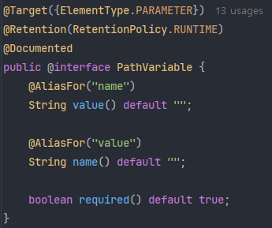
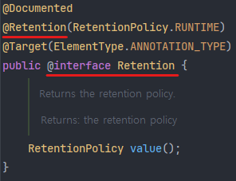
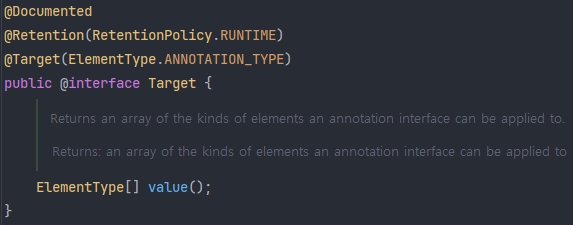
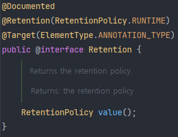

# 29_Meta Annotation

> 어노테이션에 대한 어노테이션

어노테이션을 정의할 때 사용하는 어노테이션.



## 1. 원리

메타 어노테이션을 보면 해당 어노테이션에 자기 자신이 적용되어 있는 것을 볼 수 있다.



"@Retention이 자기 자신에게 @Retention을 적용할 수 있을까?"라는 의문이 들 것이다.

### 1) 가능한 이유

#### (1) 부트스트랩 과정 (Bootstrap Process)

JVM과 자바 컴파일러는 메타 어노테이션들을 특별하게 처리한다. 언어 차원에서 미리 정의되고 하드 코딩된 동작을 가진다.

#### (2) 자기 참조

순환 참조가 아니라 정의 형태를 계층화 해보면 메타 구조라는 것을 알 수 있다.

#### (3) 컴파일러의 특별한 처리

- 컴파일러는 이미 메타 어노테이션들의 기본 동작을 내장하여 알고 있다.
- 그 다음 메타 어노테이션을 정의할 때, 이미 알고 있는 규칙을 적용하는 것이다.
- 최종적으로 개발자가 정의한 어노테이션을 처리한다.

```java
[MyAnnotation] 어노테이션
 └── @Retention(RetentionPolicy.RUNTIME)      ← 여긴 우리가 직접 @Retention작성

[Retention] 어노테이션 (java.lang.annotation.Retention)
 ├── @Target(ElementType.ANNOTATION_TYPE)     ← 이것도 어노테이션임 (메타 어노테이션)
 └── @Retention(RetentionPolicy.RUNTIME)      ← 또 다른 메타 어노테이션 (여기서 순환처럼 보이지만 실제로는 이 어노테이션에 대한 동작을 정의하는 메타 구조임)

[Target] 어노테이션
 └── @Retention(RetentionPolicy.RUNTIME)
```

위의 예시를 보면 @MyAnnotation이란 어노테이션을 정의하기 위해 해당 어노테이션이 언제까지 유지되어야 하는지를 @Retention 메타 어노테이션을 사용해서 정의하고, 컴파일러는 @Retention이라는 메타 어노테이션을 해석하여 적용한다.

즉, @Retention 자체가 메타 정보를 가지고 있는 메타 어노테이션이다. @interface Retention을 정의할 때, 이 어노테이션이 언제까지 유지될지 메타 정보를 담고 있다.

### 2) 비유

- @MyAnnotation이라는 문서를 작성 중
- 그런데 해당 문서를 작성하기 위해 문서의 보관 기간을 명시한 지침인 @Retention을 붙임
- 그 지침 역시 누군가 이 지침에 대한 유효 기간을 명시하기 위해 정의한 @Retention을 붙임

지침에 의해 지침이 정의된 단지 설계 수준에서만 존재하는 계층 구조임.

<br>

## 2. 종류

### 1) @Target

어노테이션을 어디에 적용할지 지정하는 어노테이션.

대상은 한 종류만 지정하는 것이 아니라 @Transactional과 같이 `@Target({ElementType.TYPE, ElementType.METHOD})` 여러 대상에 적용 가능하도록 정의할 수도 있다.



TYPE, FIELD, METHOD, PARAMETER, CONSTRUCTOR, LOCAL_VARIABLE, ANNOTATION_TYPE, PACKAGE, TYPE_PARAMETER, TYPE_USE, MODULE, RECORD_COMPONENT와 같은 많은 ElementType들이 있지만 많이 사용하는 것 위주로 정리.

#### (1) TYPE

클래스, 인터페이스, ENUM, 어노테이션을 대상으로 어노테이션을 붙일 수 있음을 정의.

- 예) @Component, @Configuration, @Entity 등

#### (2) METHOD

메서드를 대상으로 어노테이션을 붙일 수 있음을 정의.

- 예) @RequestMapping, @Bean 등

#### (3) FIELD

멤버 변수(필드)를 대상으로 어노테이션을 붙일 수 있음을 정의.

- 예) @Autowired, @Value, @Column, @Id 등

#### (4) PARAMETER

메서드의 매개변수를 대상으로 어노테이션을 붙일 수 있음을 정의.

- 예) @RequestParam, @RequestBody, @PathVariable

#### (5) CONSTRUCTOR

생성자를 대상으로 어노테이션을 붙일 수 있음을 정의. 

#### (6) ANNOTATION_TYPE

어노테이션 정의에 어노테이션으 붙일 수 있음을 정의(메타 어노테이션)

- 예) @Target, @Rentention, @Inherited

<br>

### 2) @Retention

어노테이션이 언제까지 유지되는지 지정하는 어노테이션.



#### (1) Source

소스 코드 수준까지만 존재하며, 컴파일 시점에는 제거된다.

- 예) IDE 상에서 경고를 주는 용도
- @Override, @SuppressWarnings

#### (2) Class

class 파일 수준까지만 존재하고 런타임 시점에는 제거된다.

- 예) 일부 코드 분석 툴, 어노테이션 프로세서 등에서 사용

#### (3) Runtime

런타임 시점까지 유지되며, 실행 중 java 리플렉션으로 조회가 가능하다.

- 대부분의 프레임워크에서 사용하는 기본 정책
- 예) 스프링 프레임워크의 다양한 어노테이션들, JPA의 어노테이션들 (@Controller, @Component, @Entity 등)

<br>

### 3) @Documented

JavaDoc에 포함될지 여부를 지정하는 어노테이션.

<br>

### 4) @Inherited

하위 클래스가 상위 클래스의 어노테이션을 상속받을지 지정하는 어노테이션.

<br>

### 5) @Repeatable

같은 어노테이션을 여러 번 적용할 수 있게 지정하는 어노테이션.