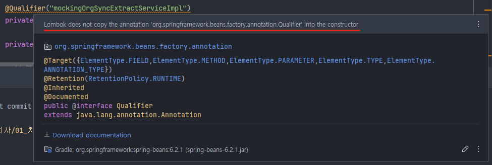

# 30_@Primary와 @Qualifier

스프링 어플리케이션에서 같은 타입의 클래스가 2개 이상 있고 이들이 빈으로 등록될 때 사용하는 어노테이션들이다.

인터페이스를 구현한 구현체가 2개 이상일 때 아무것도 명시해주지 않는다면 스프링에서는 어떤 클래스를 해당 인터페이스 타입의 빈으로 등록할지 알지 못한다. 그래서 NoUniqueBeanDefinitionException이 발생한다. (required a single bean, but 2 were found)

## 1. 명시적인 구현체 호출

인터페이스 구현체를 스프링 빈으로 주입받아 사용하려고 할 때, 굳이 인터페이스 타입으로 선언하지 말고, 실제 구현체의 타입으로 선언하여 사용하는 방법이 있다.

```java
@Controller
@RequiredArgsConstructor
public class OrgSyncController {
    private final OrgSyncExtractService orgSyncExtractService;
}
```

이렇게 하면 OrgSyncExtractService 타입의 구현체가 2개 이상일 때 에러가 발생하기 때문에 다음과 같이 구체적으로 명시해준다.

```java
@Controller
@RequiredArgsConstructor
public class OrgSyncController {
    // OrgSyncExtractService 구현체
    private final JdbcOrgSyncExtractServiceImpl jdbcOrgSyncExtractServiceImpl;
}
```

그러나 이 방법은 인터페이스를 사용하는 의미를 없애버리는 것과 마찬가지이고, 특정 구현체에 종속적인 코드가 되기 때문에 바람직한 방법이 아니다.

<br>

## 2. @Primary

같은 타입의 빈이 2개 이상 있을 때, 해당 어노테이션이 붙은 빈에게 더 높은 우선순위(higher preference)를 부여한다.

@Primary가 있으면 해당 클래스를 다른 구현체보다 먼저 빈으로 등록한다.

@Primary는 하나의 구현체를 default 값으로 사용하게 만드는 것이기 때문에 반드시 한 타입에 @Primary가 붙은 클래스는 하나여야 한다. (여러 개 사용 시 에러 발생)

따라서 보통 테스트 용도로 많이 사용하며, 일반적으로는 @Qualifier를 사용하는 것이 더 바람직하다.

<br>

## 3. @Qualifier

스프링 컨테이너가 같은 타입의 빈을 2개 이상 찾았을 때, 구체적으로 어떤 빈을 등록해야 하는지 추가적인 정보를 제공하기 위한 어노테이션이다.

인터페이스 타입의 빈을 주입받을 때, 실제로 빈으로 등록되어야 할 특정한 구현체의 이름을 명시함으로써 정확하게 특정 빈을 등록할 수 있도록 해준다.

@Primary와 @Qualifier가 둘 다 존재할 때는 @Qualifier가 더 우선한다. @Primary는 default 값을 정의하는 반면, @Qualifier는 specific한 값을 정의하기 때문에 더 구체적인 내용이 우선하기 때문이다.

### 1) @Qualifier 사용 시 주의사항

#### (1) 해당 클래스가 빈으로 등록될 때 사용될 이름으로 명시 (카멜케이스)

@Qualifier를 사용하여 인터페이스 타입의 빈을 등록할 때에는 구현체가 빈으로 등록될 이름을 명시해줘야 한다.

클래스 명은 파스칼 케이스가 표준 표기이지만, 인스턴스로 생성되었을 때는 카멜케이스로 등록한다.

따라서 @Qualifier에 명시될 구현체 명은 인스턴스로 생성되었을 때를 기준으로 해야하기 때문에 해당 구현체 클래스 명을 카멜케이스 명칭으로 작성해줘야 한다.

#### (2) Lombok과 함께 사용 시 유의사항 (필드에만 @Qualifier 사용 불가)

롬복의 생성자 완성 어노테이션을 함께 사용하면서 필드에서만 @Qualifier를 사용한다면, 구체적인 구현체 명칭을 명시했더라도 여전히 해당 구현체를 빈으로 등록하지 못하는 문제가 발생한다.



롬복이 해당 파라미터 어노테이션까지 인식하지 못하기 때문에 그렇다. 따라서 필드에서만 @Qualifier를 적용했다면 사실 상 안 사용한 것과 마찬가지이다.

이대로 사용하면 동일하게 NoUniqueBeanDefinitionException이 발생하면서 "This may be due to missing parameter name information", "Ensure that your compiler is configured to use the '-parameters' flag."라는 메세지들을 에러 로그에서 확인할 수 있다.

이는 스프링 6.x 이상(스프링부트 3버전 이상)에서 name parameter retention 이슈로 리플렉션을 통해서 파라미터의 이름을 가져오기 위해서는 컴파일 옵션에 -parameter가 있어야 한다는 내용인데, build.gradle에 하기 옵션을 추가하거나 gradle을 build tool로 사용하면 된다.

```groovy
tasks.withType(JavaCompile) {
    options.compilerArgs << "-parameters"
}
```

하지만 위 케이스의 경우 정확히 name parameter retention 이슈만으로 보기는 어렵고, 롬복이 @Qualifier를 인식하지 못하여 파라미터 정보가 모호해져서 name parameter retention 이슈로 추정되는 문제가 발생했다고 보는 것이다.

따라서 다음과 같이 필드에 사용하는 것이 아니라, 생성자를 정의하면서 생성자의 매개변수 파라미터에 명시해주는 방법으로 사용해야 한다.

```java
@Controller
public class OrgSyncController {
    private final OrgSyncExtractService orgSyncExtractService;
    
    // 생성자 매개변수에 지정
    public OrgSyncController(@Qualifier("jdbcOrgSyncExtractServiceImpl") OrgSyncExtractService orgSyncExtractService) {
        this.orgSyncExtractService = orgSyncExtractService;
    }
    
}
```

<br>