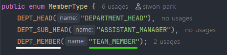
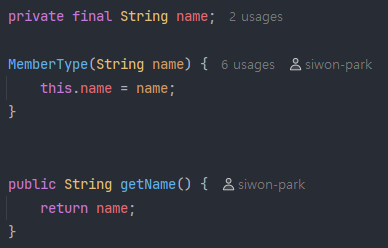

# 33_enum 타입과 직렬화

## 1. enum 타입의 직렬화 시 유의 사항

> enum 타입을 필드로 사용했을 때 직렬화 유의 사항

enum 타입을 필드로 사용했을 때, 아무 생각 없이 직렬화를 하게 되면 의도한 바와 다르게 동작해서 낭패를 볼 수도 있다.

기본적으로 enum 타입은 직렬화 시 `enum.name()`을 호출한다.

아래 캡처에서 DEPT_MEMBER가 name이 되고, TEAM_MEMBER가 value가 된다.



만약 enum에서 사용한 name과 value가 동일하다면, 굳이 문제가 되지는 않겠지만, 위의 예시처럼 name과 value가 다를 경우에는 직렬화 시 문제가 될 수도 있다.

특히, 다음과 같이 필드 자체를 name으로 선언했을 경우에는 더욱 헷갈릴 수도 있다.



getter 메서드가 있지만, 직렬화 시 getter 메서드를 호출하지는 않는다. enum.name()을 호출하기 때문이다. (역직렬화 시에는 valueOf()를 호출한다. valueOf를 통해 상수 객체 자체를 역직렬화 함)

### 1) @JsonValue

`@JsonValue` 어노테이션을 getter 메서드에 붙이면, 직렬화 시 해당 메서드를 호출하여 리턴받은 값을 사용하게 된다.


즉, enum 타입에서 value를 직렬화 하고 싶다면 반드시 getter 메서드에 @JsonValue를 추가하도록 하자.

<br>

## 2. JPA에서의 직렬화

enum 타입을 엔티티의 필드로 사용했을 때 JPA에서는 어떻게 직렬화를 할까?

마찬가지로 기본적으로는 enum.name()을 호출하기 때문에 enum의 필드의 name으로 직렬화가 된다.

JPA에서의 value 값으로 직렬화를 위해서는 Converter(컨버터)를 구현해줘야 한다.

```java
public enum Status {
    PENDING("P"),
    APPROVED("A");
    // ... 중략 ...
}
```

```java
@Entity
public class Order {
    @Id
    private Long id;
    // EnumType.STRING → name() 호출해서 "PENDING" 저장, "P"(X)
    @Enumerated(EnumType. STRING)
    private Status status; 
}
```

기본적으로 enum의 name으로 직렬화해서 저장하기 때문에 다음과 같이 컨버터를 구현해주면 된다.

```java
@Converter(autoApply = true)
public class StatusConverter 
    implements AttributeConverter<Status, String> {
    
    @Override
    public String convertToDatabaseColumn(Status status) {
        return status.getCode();  // "P" 저장
    }
    
    @Override
    public Status convertToEntityAttribute(String code) {
        return Status.from(code);
    }
}
```

### 1) autoApply

autoApply의 값이 true일 경우에는 컨버터의 구현 내용이 자동으로 적용되지만, false일 경우에는 명시적으로 정의해줘야 한다.

- 컨버터의 autoApply가 false일 경우

```java
@Entity
public class Order {
    @Id
    private Long id;
    
    @Convert(converter = StatusConverter.class)  // 어떤 컨버터를 적용할 것인지 명시 필요!
    private Status status;
}
```


