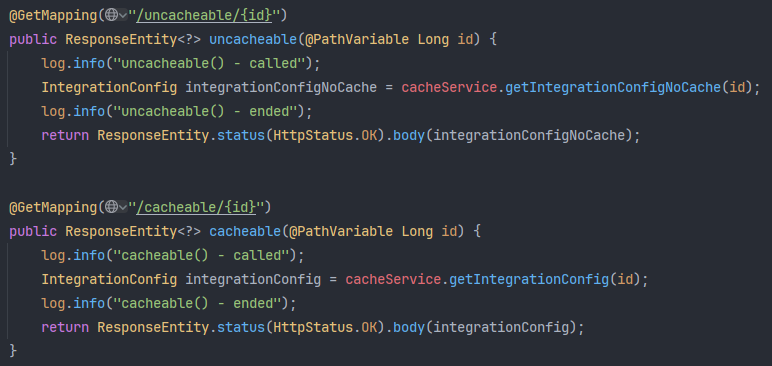
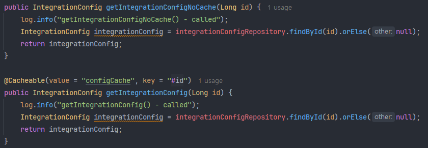
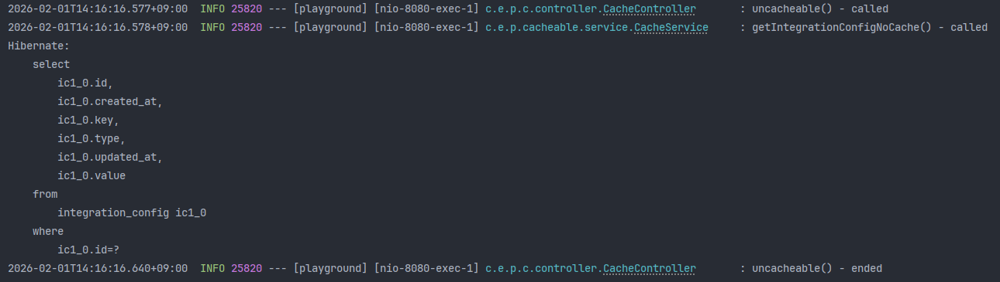
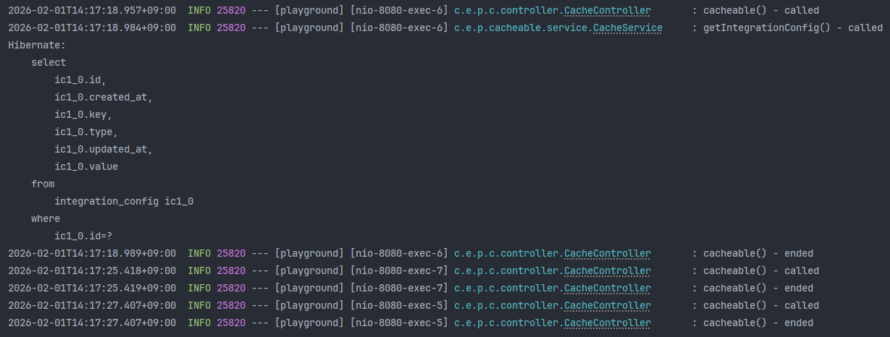

# 35_캐싱 어노테이션

> @EnableCaching, @Cacheable, @CacheEvict

## 1. @EnableCaching

> 캐싱 기능 활성화를 위한 어노테이션

@Configuration 혹은 @SpringbootApplication 어노테이션이 붙은 클래스 위에 붙이는 어노테이션.

스프링 AOP를 통해서 @Cacheable과 같은 캐싱 어노테이션이 붙은 메서드를 가로채서 캐싱 기능을 활용할 수 있도록 해주는 역할을 한다.

```java
@Configuration
@EnableCaching
public class CacheConfig {
    // 필요에 따라 CacheManager(Redis, Ehcache 등)를 빈으로 등록
    // 등록하지 않으면 기본적으로 ConcurrentHashMap을 사용하는 인터널 캐시가 동작
}
```

### 1) 관심사의 분리

메인 클래스와 설정 클래스 둘 중 어디에 붙여도 상관은 없으나, 보통 설정 클래스를 따로 두고 그 위에 붙이는 방식이 권장된다. (별도 캐시 매니저 설정을 하지 않는다면 메인 클래스에 붙여도 무방)

#### (1) 빠른 시작

별도의 상세 설정 필요 없이 빠르고 간단하게 캐싱 기능을 활성화하고자 하면 @SpringbootApplication이 붙은 클래스 위에 @EnableCaching을 붙여준다.

손쉽게 관리할 수 있다는 장점이 있지만, 만약 별도의 캐시 설정 클래스가 있음에도 메인 클래스에 @EnableCaching을 붙여놓는다면 코드 추적에 혼선을 주기 때문에 유의해야 한다.

또한 메인 클래스에 캐싱 활성화 어노테이션이 붙어 있을 경우 어플리케이션 컨텍스트를 띄울 때 무조건 캐시 기능이 활성화되기 때문에 테스트 실행 시, 캐시 기능을 끄고 싶어도 끌 수가 없다는 단점이 있다.

#### (2) 상세 설정

캐시를 세밀하게 제어하려면 @Configuration이 붙은 클래스 위에 @EnableCaching을 붙여준다.

그리고 설정 파일에서 어떤 캐시 매니저를 사용할지, 어떤 캐시 로직을 가져갈지에 대한 설정을 정의해준다.

만약 정의하지 않을 경우 기본적으로 ConcurrentHashMap을 사용하는 스프링의 인터널 캐시 매니저가 동작한다. (사실상 메인 클래스 위에 붙이는 것과 차이 없음)

설정 파일을 따로 두고 관리할 경우 "캐시 관련 설정은 이 클래스 파일에서 담당함"이라는 의도를 가지며, 해당 파일을 수정/관리하면 되니 유지보수 측면에서 용이하다.

또한 별도 설정으로 관리하니 테스트 실행 시 해당 설정만 빼고 로드할 수도 있다는 장점이 있다.

<br>

## 2. @Cacheable

> 캐싱을 하기 위한 어노테이션

읽기 전용 캐시 기능으로, 메서드 실행 전 캐시를 먼저 확인하고 있을 경우 반환, 없으면 메서드를 실행한 다음에 결과를 캐시에 저장하고 반환한다.

스프링 AOP를 활용하기 때문에 같은 클래스 내에서 this 등으로 메서드를 호출하면 self-invocation으로 인해 캐싱이 동작하지 않는다.

```java
@Cacheable(value = "configCache", key = "#id")
public IntegrationConfig getConfig(Long id) {
    // 캐시가 비어있을 때만 아래 로직이 실행됨
    return repository.findById(id).orElseThrow();
}
```

### 1) 속성

- value: 캐시 저장소의 이름
  - 캐시 저장소 내에서 해당하는 캐시 데이터의 key를 찾아서 데이터를 조회하는 형태
- key: 키 값. 캐시 내에서 데이터를 구분하기 위한 키 값으로 SpEL(Spring Expression Language)을 사용한다. 문자열 내에서 #id와 같은 문법을 적용 가능.
  - 만약 일반 문자열 형태로 키를 적용해놓았다면 캐시를 삭제(evict)할 때 해당 키에 해당하는 캐시 저장소를 모두 날리기 때문에 유의해야 함.
  - 위 예시에서 key의 #id에서의 id와 메서드 파라미터의 id는 같은 id를 지칭한다. (#dto.id와 같이 dto를 파라미터로 받았을 때, 해당 dto의 id를 사용할 수도 있음)
- condition: 특정 조건일 때만 캐시를 적용하도록 하는 속성.
  - ex) condition = "#id > 100"
- unless: 메서드 결과가 특정 조건일 때 캐시에 저장하지 않는 속성.
  - ex) unless = "#result == null"
  - 결과가 null일 경우에는 캐시에 저장하지 않음

### 2) TTL

별도로 캐시 매니저 설정을 하지 않을 경우에 캐시의 TTL은 무한대이다. (@CacheEvict로 명시적으로 지우기 전까지는 캐시를 유지함)

따라서 캐시에 데이터가 계속해서 쌓일 수 있다면, 메모리 부족으로 OOM이 발생할 수도 있다.

TTL을 무한으로 설정한 이유는 스프링의 캐시가 추상화 영역이며, 캐시 저장소(redis, ehcache, caffeine 등)에 따라 TTL이 달라질 수도 있기 때문에 기술에 종속적인 TTL옵션을 별도 설정하지 않은 것이다.

### 3) 동작 예시

다음과 같이 컨트롤러를 만들고



서비스 코드를 아래와 같이 짰을 경우



uncacheable의 경우 아래 로그와 같이 매번 하이버네이트로 sql이 실행되는 것을 확인할 수 있지만,



cacheable의 경우 최초 한 번 실행 후에는 컨트롤러의 로그만 계속해서 찍히는 것을 확인할 수 있다. 즉, 캐시에서 데이터를 가져옴을 확인할 수 있음.



<br>

## 3. @CacheEvict

> 캐시 초기화를 하기 위한 어노테이션

DB 데이터가 수정/삭제되었을 때, 유효하지 않게 된 캐시 데이터를 삭제하는 역할을 하는 어노테이션.

@CachePut이라는 수정 시 캐시를 삭제하지 않고 업데이트하는 어노테이션이 있지만, 보통은 캐시를 삭제한 후, 다음번 조회 시 새로 생성하는 방식이 더 단순하고 안전하다.

```java
@CacheEvict(value = "configCache", key = "#id")
public void updateConfig(Long id, UpdateDto dto) {
    repository.update(id, dto);
}
```

### 1) 속성

- key: 삭제할 캐시 데이터의 키 값
- value: 캐시 저장소의 이름
- allEntries: true일 경우 해당 캐시 저장소(value)에 있는 모든 데이터를 삭제함 (기본값은 false)
- beforeInvocation: true일 경우 메서드 실행 전 캐시를 삭제함 (기본값은 false로, 메서드 성공 실행 후에 삭제함)