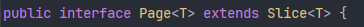

# 36_페이지네이션(Pagination)

> 대량의 데이터를 일정 단위(사이즈)로 나눠서 조회하는 기법

## 1. 개념

페이지란 많은 양의 데이터 중 일부 데이터 파편을 의미하며, 내용(컨텐츠)뿐만 아니라 여러 부가적인 정보도 함께 갖고 있다.

대량의 데이터를 한 번에 조회해온 다음에 로딩하거나 보여줄 경우 속도 지연, OOM 등의 이슈가 있을 수 있기 때문에 지금 당장 클라이언트에 필요한 정보 일부만 보여주는 방식으로 최적화하는 것이 페이징 처리(혹은 페이지네이션)라고 한다.

페이지의 응답 예시는 아래와 같으며 컨텐츠(내용) 외에도 다른 부가적인 정보들을 같이 담고 있다. (※ 페이지의 시작은 항상 0부터 시작함을 유의)

```json
{
  "content": [ ... ],
  "pageable": { "pageNumber": 0, "pageSize": 10 },
  "totalPages": 5,
  "totalElements": 48,
  "last": false,
  "first": true,
  "numberOfElements": 10
}
```

- content: 내용(데이터 객체 정보 등)
- pageable: 요청한 페이지(pageNumber)와 한 페이지 내에 있는 데이터의 개수(size)
- totalPages: 총 페이지 수
- totalElements: 총 데이터 수
- numberOfElements: 현재 페이지의 데이터 수

컨텐츠 외에 페이지와 관련된 부가 정보가 있는데, 이들은 페이지 처리를 위해서 반드시 필수적인 정보들이다. 이러한 정보 없이 데이터 내용만 있다면 현재 페이지가 몇 페이지인지, 남은 페이지가 얼마나 되는지 등을 알 수 없기 때문에 그냥 부분적으로 데이터를 조회해온 것과 다를바가 없기 때문이다.

<br>

## 2. 종류

### 1) Offset 기반

가장 일반적인 페이지네이션 방식으로 "몇 번째 페이지"를 요청하는 방식으로, 일반적인 데이터(게시판 등) 페이지 처리에 많이 사용된다.

SQL 쿼리에서 사용하는 offset과 동일한 개념이라고 이해하면 된다.

다만, offset 기반의 페이지네이션은 대용량 데이터일 경우에 성능 문제가 있을 수도 있다.

- 첫 번째 문제로는 offset 쿼리 특성상 DB에서 앞에 있는 데이터를 전부 읽은 다음에 버리기 때문에 느려진다는 점이 있고,
- 두 번째 문제로는 페이징 처리시 전체 데이터의 개수를 세기 위해 마지막에 count 쿼리를 날리는데 데이터가 많으면 count 쿼리 자체가 무거워질 수밖에 없다.

또한 중간에 데이터가 수정(추가, 삭제)될 경우 데이터 중복/누락 발생 가능성이 있다.

<br>

### 2) Cursor 기반

"마지막으로 본 데이터 이후"의 데이터를 요청하는 페이지네이션 방식으로, 대용량 데이터에 유리하며 주로 무한 스크롤, 피드형 데이터 제공에 적합하다.

offset 기반의 페이지네이션과 달리 특정 페이지로 이동하는 것은 불가능하다. 다만, 마지막 데이터 이후를 기준으로 검색하기 때문에 데이터 중복/누락의 가능성이 없다는 장점이 있다. (마지막으로 본 데이터의 id 이후의 데이터를 기준으로 검색하기 때문)

<br>

### 3) 조합

페이지네이션 종류에 따른 후술할 페이징 방식과의 조합은 다음과 같다.

| 조합           | 가능 여부                                   |
| -------------- | ------------------------------------------- |
| Offset + Page  | ✅ 일반적                                    |
| Offset + Slice | ✅ 가능                                      |
| Cursor + Slice | ✅ 가장 잘 어울림                            |
| Cursor + Page  | ✅ 가능하지만 어색함 (totalCount가 의미없음) |

<br>

## 2. Spring Data JPA의 페이징

Spring 진영에서는 Spring Data JPA가 페이지네이션을 위한 편의성을 제공하고 있어 이를 활용해서 페이징 처리를 할 수 있다.

대표적으로 제공하는 인터페이스에는 Page와 Slice가 있다. (※ 둘 다 글자 그대로 java의 interface 타입이다)

### 1) Page



Page는 Slice 인터페이스를 상속한 인터페이스이다. 따라서 Slice가 가진 기본적인 기능들은 Page도 가지고 있다.

다만 Slice와 다른 차이점이 있다면, Page는 전체 데이터 개수와 전체 페이지 수를 알고 있다는 점이다. 이를 알기 위해 내부적으로 무조건 전체 개수를 세는 count 쿼리가 나간다.

Page는 다음과 같은 정보를 가지고 있다.

- `getContent()`: 조회된 데이터 리스트 (`List<T>`)
- `getTotalElements()`: DB에 있는 조건에 맞는 전체 데이터 개수
- `getTotalPages()`: 전체 페이지 수 (전체 개수 / 페이지 사이즈)
- `getNumber()`: 현재 페이지 번호 (**0부터 시작함에 주의!**)
- `getSize()`: 한 페이지에 보여줄 데이터 개수
- `getNumberOfElements()`: 현재 페이지에 실제 들어있는 데이터 개수
- `hasPrevious()` / `hasNext()`: 이전/다음 페이지 존재 여부
- `isFirst()` / `isLast()`: 첫 번째/마지막 페이지 여부

#### (1) PageImpl

Page는 인터페이스이기 때문에, 타입으로 쓰일 수는 있어도 반환을 하기 위해서는 이를 구현한 객체여야 한다.

Repository에서 @Query, Specification, Spring Data JPA가 제공하는 기본 메서드(findAll 등)를 사용할 경우, Spring이 내부적으로 알아서 자동으로 PageImpl을 만들어서 반환한다.

```java
// 1. @Query 사용
@Query("select m from Member m where m.name = :name")
Page<Member> findByName(@Param("name") String name, Pageable pageable); // Spring이 내부적으로 new PageImpl()을 수행하여 반환함

// 2. Specification 사용
Page<Member> page = memberRepository.findAll(spec, pageable); // findAll 메서드 내부에서 이미 PageImpl을 생성해서 리턴함
```

굳이 개발자가 코드를 장황하게 작성할 필요가 없어 간결하고 명확한 코드 작성으로 유지보수가 용이하다는 장점이 있다.

하지만 Querydsl 혹은 직접 SQL 쿼리를 작성했을 경우에는 개발자가 직접 Page 객체를 생성해줘야 한다. 간혹 코드를 보면 페이지 처리 시 반환할 때 `new PageImpl<>(객체 리스트, pageable, 전체개수)`의 형태로 반환하는 것을 볼 수 있는데, 바로 이것이다.

- 별도 직접적으로 처리해주는 이유는 앞서 말했듯이 Page가 객체가 아니라 인터페이스라는 점에 있고,
- querydsl과 같은 기술을 사용했을 때, 메서드의 반환 타입은 List이기 때문에 직접 Page로 감싸는 과정이 필요한 것이다.
- 직접 처리를 해야하기 때문에 count 쿼리도 직접 수행해줘야 한다!
  - 번거로울 수도 있지만 다만 이점에 있어서 하단에서 서술할 성능 최적화가 가능해진다는 장점도 있다.

결국 프레임워크가 제어하는가 vs. 개발자가 직접 제어하는가의 차이이다.

#### (2) 성능 최적화

Page를 사용할 때, 마지막에 무조건 count 쿼리가 나간다. 데이터가 적을 경우에 count 쿼리가 미치는 영향은 미미하지만, 데이터가 많을 경우에는 count 쿼리 자체가 무거워져 부하를 줄 수 있다.

PageableExecutionUtils를 사용할 경우 count 쿼리에 대한 성능 최적화가 가능하다. 불필요한 상황에서 굳이 count 쿼리를 수행하지 않도록 처리하는 것이다.

```java
return PageableExecutionUtils.getPage(content, pageable, countQuery::fetchOne);
```

- 첫 페이지인데 전체 데이터 개수가 사이즈보다 작으면 굳이 count 쿼리를 날릴 필요가 없다.
- 또는 마지막 페이지일 때는 offset + 현재 리스트의 사이즈 = 전체 개수이기 때문에 굳이 count 쿼리를 날릴 필요가 없다.

count 쿼리가 정말 무거워서 성능에 지장을 줄 경우에는 Slice를 사용하여 쿼리 비용을 절감하기도 한다.

<br>

### 2) Slice

Slice 역시 인터페이스로 Streamable을 상속받은 인터페이스이다. "다음 페이지가 존재하는가" 유무만 알면 되는 경우에 사용한다.

내부적으로 요청한 size + 1개(쿼리 상으론 limit + 1)를 조회해서 다음 데이터의 존재 여부(`hasNext()`)만 고려한다. 따라서 count 쿼리를 날릴 필요가 없다. 다음 페이지가 있을 경우에만 필요할 경우 또 쿼리를 날려서 다음 페이지를 얻으면 되기 때문이다.