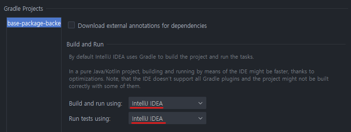
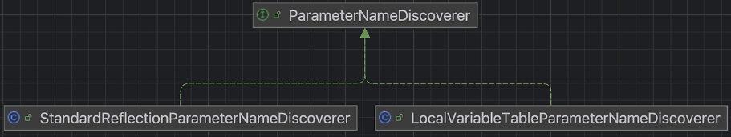

# 01_스프링부트3_Name for argument of type not specified 에러

> Parameter Name Retention

## 1. 상황

연동 VM 백엔드 개발을 끝내고 프론트를 로컬에 실행하여 연결 및 통합 테스트를 하려고 하였음.

그러나 프론트 서비스를 실행하자마자 세션 정보를 얻지 못하여 오류 페이지로 리다이렉트되고 있었음.

원인을 몰라서 사수와 팀원에게 물어본 결과, 세션 관련 이슈가 있어서 세션을 얻기 위해 직접 특정 url을 호출해야 했음.

전달받은 url을 입력했음에도 불구하고, 다른 팀원분의 로컬에서는 잘 되는데 내 로컬에서는 동작하지 않는 이슈가 발생하였음.

### 1) 에러 로그

```bash
2025-06-30 10:00:22   [http-nio-8080-exec-2] ERROR o.a.c.c.C.[.[.[.[dispatcherServlet] - Servlet.service() for servlet [dispatcherServlet] in context with path [] threw exception [Request processing failed: java.lang.IllegalArgumentException: Name for argument of type [java.lang.String] not specified, and parameter name information not available via reflection. Ensure that the compiler uses the '-parameters' flag.] with root cause
java.lang.IllegalArgumentException: Name for argument of type [java.lang.String] not specified, and parameter name information not available via reflection. Ensure that the compiler uses the '-parameters' flag.
	at org.springframework.web.service.invoker.AbstractNamedValueArgumentResolver.updateNamedValueInfo(AbstractNamedValueArgumentResolver.java:146)
	... 중략 ...
```

에러 로그 확인 결과 Name for argument of type not specified라는 에러가 발생하고 있었음.

처음 보는 에러여서 매우 당황했음.

<br>

## 2. 경과

에러 로그 트레이스를 쭉 따라가 본 결과, 클라이언트를 호출하는 쪽에서 문제가 발생하고 있었음.

그런데 특이한 점을 못 느꼈고, AI를 통해서 여러 가지 시도를 했으나 API 호출부에 있는 @RequestParam이라고 말했음.

- 잘못된 코드

```java
@RestController
public class HelloController {
 
    @GetMapping("/hello")
    public String hello(@RequestParam name) {
        return "Hello $name"
    }
}
```

- 올바른 코드

```java
@RestController
public class HelloController {
 
    @GetMapping("/hello")
    public String hello(@RequestParam("name") name) {
        return "Hello $name"
    }
}
```

파라미터의 이름 명시해줘야 한다는 것이 결론이었으나, 해당 부분을 고쳤더니 다른 에러가 발생하며 여전히 세션을 제대로 얻지 못하는 상황이었음.

### 1) 해결

build.gradle에도 -parameter 관련 옵션을 넣어줬으나 문제가 해결되지 않았고, 갑자기 문득 의심가는 부분이 생각나서 해당 부분의 설정을 변경하였더니 해결되었다.

인텔리제이 상에서 Build and run using과 Run tests using 옵션을 IntelliJ IDEA로 설정하고 있었던 부분을 Gradle로 변경하였다.



그랬더니 정상적으로 클라이언트를 호출하고 세션 정보를 받아올 수 있었다.

평소 테스트 코드를 짜다보니 테스트 관련해서 오류가 발생하여 해당 옵션을 IntelliJ IDEA로 설정한 것이 화근이었다.

<br>

## 3. 결론

그런데 왜 이렇게 해야할까?

원인은 스프링부트3으로 버전이 올라가면서 생긴 영향 때문이었다.

### 1) SpringBoot3 Parameter Name Retention

#### (1) LocalVariableTableParameterNameDiscoverer

스프링에서는 파라미터의 이름을 가져오는 여러 가지 방법이 있는데, 해당 역할을 추상화한 인터페이스가 ParameterNameDiscover이며, 구현체 중 하나로 LocalVariableTableParameterNameDiscoverer라는 클래스가 존재했다.



아래와 같은 코드를 작성했을 때, 컴파일을 하게 되면 

```java
public class Example {
    public void exampleMethod(int param1, String param2) {
        int localVar = param1 + 1;
    }
}
```

다음과 같은 바이트 코드가 생성된다.

```java
... (중략) ...
    
	LocalVariableTable:
      Start  Length  Slot  Name   Signature
          0      12     0  this   LExample;
          0      12     1  param1 I
          0      12     2  param2 Ljava/lang/String;
          4       8     3 localVar I
```

LocalVariableTableParameterNameDiscoverer는 LocalVariableTable이라는 메서드 로컬 변수 정보를 저장한 테이블에서 값에서 파라미터 이름을 얻어온다. (바이트 코드를 파싱하여 파라미터 이름을 얻음)

문제는 LocalVariableTableParameterNameDiscoverer이 버전이 올라가면서 deprecated, removed 되었고, 이에 대한 대안으로 StandardReflectionParameterNameDiscoverer가 사용되기 시작하였다.

#### (2) StandardReflectionParameterNameDiscoverer

StandardReflectionParameterNameDiscoverer는 클래스 명에서 봐도 알 수 있듯이 리플렉션을 통해 파라미터 이름을 가져온다.

문제는 리플렉션을 통해서 해당 값을 가져오려면 컴파일 시에 `-parameter`라는 옵션을 반드시 추가해줘야 한다. 그래서 상기 잘못된 코드로 언급했던 코드가 예전에는 정상적으로 동작했지만 더 이상 `-parameter`옵션 없이는 동작하지 않게 된 것이다.

### 2) 그런데 이게 Gradle 옵션이랑 무슨 상관?

컴파일 시에 `-parameter`옵션을 추가해주면 jdk8 이상에서 컴파일 시에 리플렉션 api를 활용하여 파라미터 정보를 가져올 수 있다.

하지만 만약에 Gradle 기반으로 빌드 및 배포를 한다면, 굳이 해당 옵션을 추가하지 않아도 정상적으로 처리가 가능하다! 그 이유는 Gradle 플러그인과 SpringBoot의 추가적인 설정 덕분이다. [스프링 공식 문서](https://docs.spring.io/spring-boot/gradle-plugin/reacting.html#reacting-to-other-plugins.java)를 들어가서 확인해보면 내용을 확인할 수 있다.

Reacting to the Java Plugin 항목의 12번을 보면, "Configures any `JavaCompile` tasks to use the `-parameters` compiler argument."라는 내용을 확인 할 수 있다.

코드 상으로는 다음과 같이 옵션을 추가하고 있다.

- spring-boot/spring-boot-project/spring-boot-tools/spring-boot-gradle-plugin/src/main/java/org/springframework/boot/gradle/plugin
  /JavaPluginAction.java

```java
	private void configureParametersCompilerArg(Project project) {
		project.getTasks().withType(JavaCompile.class).configureEach((compile) -> {
			List<String> compilerArgs = compile.getOptions().getCompilerArgs();
			if (!compilerArgs.contains(PARAMETERS_COMPILER_ARG)) {
				compilerArgs.add(PARAMETERS_COMPILER_ARG);
			}
		});
	}
```

Build 설정을 IntelliJ IDEA로 해놓으면 해당 기능을 사용할 수 없어서 에러가 발생하는 것이었다.

### 3) IntelliJ IDEA vs. Gradle

Build and run using과 Run tests using 설정에서 두 옵션 간에 무슨 차이가 있을까?

#### (1) IntelliJ IDEA

- 장점
  - IntelliJ IDEA 내부 컴파일러 사용
  - 증분 컴파일을 통해 속도가 빠름
  - 디버깅 등 분석에 원활
  - IDE가 이미 메모리 로드된 클래스 정보를 활용하여 효율적임
- 단점
  - 실행 환경 차이 - 실제 빌드/배포 환경과 다를 수 있음
  - **일부 Gradle 플러그인이 적용되지 않을 수 있음**

#### (2) Gradle

- 장점
  - 일관성 - 개발/빌드/배포 환경이 모두 동일하며 결과도 동일함
  - 정확성 - build.gradle에 있는 설정이 100% 반영됨
  - 모든 gradle 플러그인이 지원됨
- 단점
  - gradle 데몬을 사용하기 때문에 속도가 느림
  - 별도의 jvm 프로세스를 실행하여 자원을 추가 사용함

